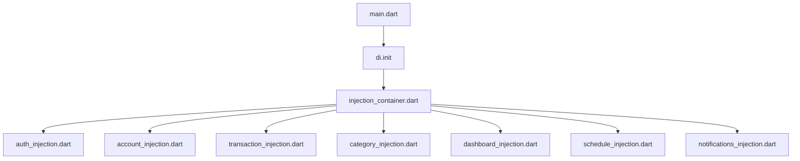

# Dependency Map (dependency_map.md)

This reference outlines the allowed dependencies, import paths, and modular boundaries of the **DueDay** application.

---

## 🔀 1. Layer Dependency Rules

DueDay enforces a unidirectional layer-import boundary. Violating these boundary guidelines will trigger analyzer errors and break layer isolation.

```
┌────────────────────────────────────────────────────────┐
│                      PRESENTATION                      │
│     Can import: PRESENTATION, DOMAIN, CORE             │
│     CANNOT import: DATA                                │
└──────────────────────────┬─────────────────────────────┘
                           │
                           ▼
┌────────────────────────────────────────────────────────┐
│                         DOMAIN                         │
│     Can import: DOMAIN, CORE (pure Dart utilities)     │
│     CANNOT import: PRESENTATION, DATA                  │
└──────────────────────────▲─────────────────────────────┘
                           │
                           │
┌────────────────────────────────────────────────────────┐
│                          DATA                          │
│     Can import: DOMAIN, DATA, CORE                     │
│     CANNOT import: PRESENTATION                        │
└────────────────────────────────────────────────────────┘
```

---

## 🛠️ 2. Cross-Feature Dependency Matrix

To maintain loose coupling, features should remain as self-contained as possible. When a page requires combined dataset parameters (e.g., the Dashboard page), compile them in the Presentation layer of the consuming feature by calling UseCases of other features:

| Feature | Allowed UseCase / Repository Imports | Purpose |
| :--- | :--- | :--- |
| **`auth`** | None | Handles its own user model. |
| **`accounts`** | None | Independent account management. |
| **`categories`** | None | Independent category tags. |
| **`transactions`** | `accounts` (domain), `categories` (domain) | Read accounts (for updating balances) and categories (to tag transactions). |
| **`dashboard`** | `accounts` (domain), `transactions` (domain) | Aggregate account balances and filter upcoming transaction due dates. |
| **`schedule`** | `transactions` (domain) | Retrieve transactions list to group by due dates. |
| **`notifications`**| None | Push notifications parameters. |
| **`profile`** | `auth` (domain) | Manage profile data and sign out. |
| **`splash`** | `auth` (domain) | Listen to authentication state. |

---

## 💉 3. Dependency Injection Mapping

Injections are configured modularly inside `lib/core/injection/` and loaded during setup in `lib/main.dart`:



### Injection Lifecycle Standards
- **`registerFactory`**: Instantiated on every call (mostly used for UI BLoCs).
- **`registerLazySingleton`**: Instantiated once when requested (mostly used for DataSources, Repositories, and UseCases).
- **`registerSingleton`**: Instantiated immediately during startup (e.g. Firebase instance).
