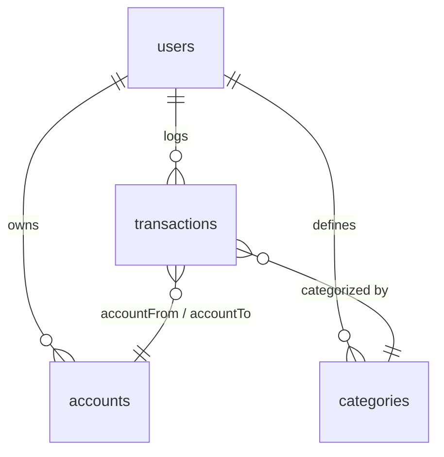

# Firestore Database Schema (firestore_schema.md)

This reference maps out the collections, subcollections, fields, data types, and relationships stored in **Cloud Firestore** for the **DueDay** application.

---

## 🗄️ 1. Root Collection: `/users`

### Document Path: `/users/{userId}`
Represents a single user profile.

| Field Name | Data Type | Description |
| :--- | :--- | :--- |
| `email` | String | User's primary email address (from Firebase Auth). |
| `displayName` | String | User's full name. |
| `photoUrl` | String | User's profile avatar (optional). Either an external URL (e.g. from Google Sign-In) or a client-compressed `data:image/jpeg;base64,...` string picked from the device — the app has no Firebase Storage upgrade, so custom avatars are stored inline, resized/compressed client-side to stay well under Firestore's 1 MiB document limit. |
| `createdAt` | Timestamp | Date and time the account was registered. |

---

## 💳 2. Subcollection: `/users/{userId}/accounts`

### Document Path: `/users/{userId}/accounts/{accountId}`
Represents a financial account, credit card, or wallet.

| Field Name | Data Type | Description |
| :--- | :--- | :--- |
| `name` | String | Account identifier (e.g. "Nubank", "Cash Wallet"). |
| `type` | String | Account category: `savings`, `investments`, `daily_use`, `credit_card`. |
| `balance` | Double | The current monetary balance in the account. |
| `dueDate` | Timestamp | Statement closing date (applicable to `credit_card` type). |
| `createdAt` | Timestamp | Creation date and time. |

---

## 🏷️ 3. Subcollection: `/users/{userId}/categories`

### Document Path: `/users/{userId}/categories/{categoryId}`
Represents custom categories created by the user to organize transactions.

| Field Name | Data Type | Description |
| :--- | :--- | :--- |
| `name` | String | Category display label (e.g. "Dining Out"). |
| `color` | String | Hex representation of label colors (e.g., "#FF5722"). |
| `icon` | String | Mapped icon asset identifier (e.g. "restaurant"). |
| `createdAt` | Timestamp | Creation date and time. |

---

## 💰 4. Subcollection: `/users/{userId}/transactions`

### Document Path: `/users/{userId}/transactions/{transactionId}`
Stores financial inputs, outputs, and inter-account transfers.

| Field Name | Data Type | Description |
| :--- | :--- | :--- |
| `type` | String | Transaction category: `income`, `expense`, `transfer`. |
| `amount` | Double | Monetary value of the transaction. |
| `category` | String | Reference ID to a Category document (not used for transfers). |
| `accountFrom` | String | Source Account document ID (required for expense and transfer). |
| `accountTo` | String | Destination Account document ID (required for income and transfer). |
| `dueDate` | Timestamp | The payment deadline (for scheduling and reminders). |
| `paidDate` | Timestamp | The timestamp indicating when the transaction was completed. |
| `paid` | Boolean | True if transaction is complete, false if upcoming/pending. |
| `isRecurring` | Boolean | Indicates whether the transaction repeats over a set period. |
| `description` | String | Brief description or notes. |
| `createdAt` | Timestamp | Timestamp indicating when the log was created. |

---

## 🔗 5. Entity Relationships

- **Referential Integrity:** References like `category`, `accountFrom`, and `accountTo` store the raw document ID string of the target document.
- **Cascading Deletions:** If a user deletes an Account or Category document, ensure the BLoC or UseCase deletes or updates associated Transactions to prevent dead references.
