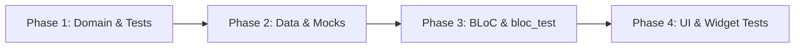

# Standard Procedure: Implement Feature with Tests (implement_feature.md)

This guide describes the complete development flow of implementing a feature alongside its automated tests.

---

## 🏗️ The 4-Phase Development Cycle



---

## 🛠️ Step-by-Step Implementation Recipe

### Phase 1: Domain & Unit Tests

1.  **Define Entities & Repositories Contract:** Write `my_feature_entity.dart` and `my_feature_repository.dart`.
2.  **Define UseCases:** Implement actions like `MyUseCase`.
3.  **Write UseCase Tests:** Create `test/features/my_feature/domain/usecases/my_usecase_test.dart` to verify logic.
    - Test success results return a `Right` type.
    - Test server/local errors return a `Left` type wrapping a failure.

### Phase 2: Data & DataSource Mocks

1.  **Write Models:** Implement JSON serializers with Freezed.
2.  **Write DataSources:** Hook client database drivers or APIs.
3.  **Implement Repository:** Catch errors and map models to entities.
4.  **Write Repository Tests:** Create `test/features/my_feature/data/repositories/my_repository_impl_test.dart` using mock DataSources.

### Phase 3: BLoC & bloc_test

1.  **Define Events and States:** Design layout indicators.
2.  **Implement BLoC logic:** Listen to events and execute UseCases.
3.  **Write BLoC Tests:** Create `test/features/my_feature/presentation/bloc/my_bloc_test.dart` using `bloc_test`:
    ```dart
    blocTest<MyBloc, MyState>(
      'emits [MyLoading, MyLoaded] on success',
      build: () {
        when(() => mockUseCase(any())).thenAnswer((_) async => Right(testData));
        return MyBloc(useCase: mockUseCase);
      },
      act: (bloc) => bloc.add(const FetchEvent()),
      expect: () => [
        MyLoading(),
        MyLoaded(testData),
      ],
    );
    ```
    - **Resource Cleanup:** While `blocTest` automatically disposes of the BLoC it builds, ensure any other custom StreamControllers, manual BLoC instances, or subscription streams instantiated in `setUp` are closed in `tearDown` to prevent memory leaks.

### Phase 4: UI & Widget Tests

1.  **Build Layout:** Assemble widgets using `DueDayTheme` and localizations.
2.  **Write Widget Smoke Tests:** Ensure views display fields, react to clicks, and trigger BLoC streams.
    - Wrap the test subject in a mock `MultiBlocProvider` and a `MaterialApp` with the `DueDayTheme`.
    - **Localization Consideration:** When asserting or searching for elements by text, use localized strings (e.g., using translation keys from `AppLocalizations`) instead of hardcoded strings to ensure tests remain resilient and compatible with supported locales.
3.  **Verify Coverage:** Verify that coverage requirements are satisfied:
    - **Coverage Standard:** Every new or modified file must reach a minimum of **80% code coverage** (excluding generated files like `.freezed.dart` or `.g.dart`).
    - **Step-by-Step Verification:**
      1. Run all tests and generate the coverage report:
         ```bash
         fvm flutter test --coverage
         ```
      2. Verify that all tests pass without errors.
      3. Check the `coverage/lcov.info` file (or generate a visual HTML report using `genhtml coverage/lcov.info -o coverage/html`) to ensure that the coverage for the new/modified files meets or exceeds the 80% threshold.
